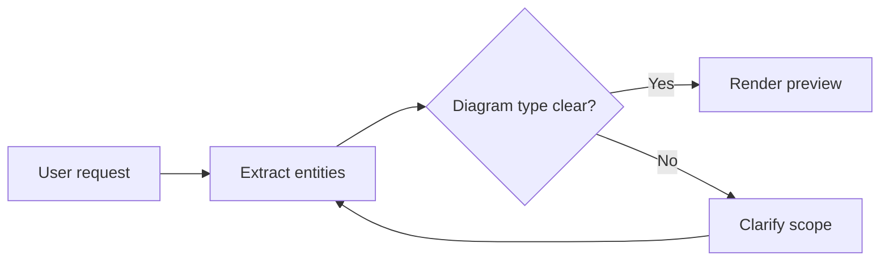
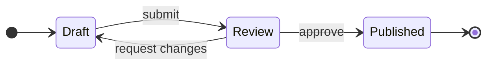
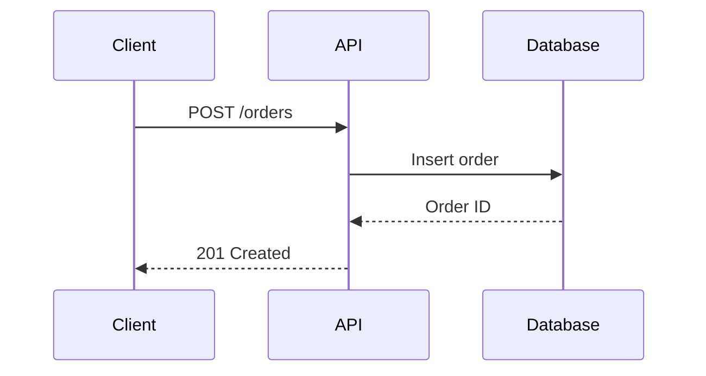
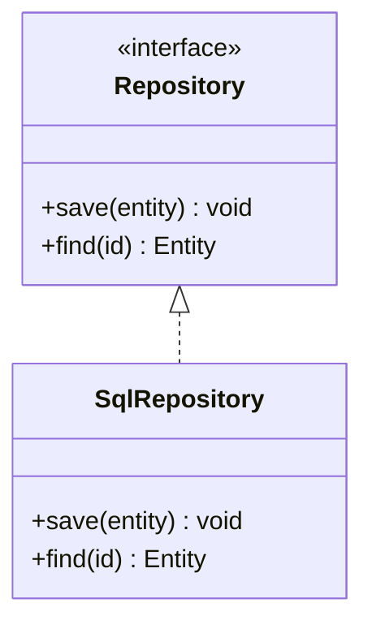
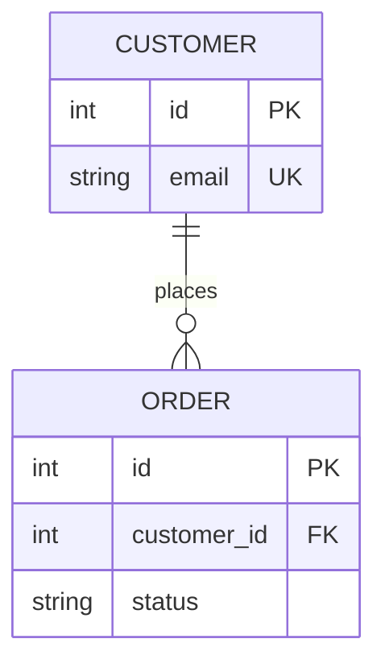
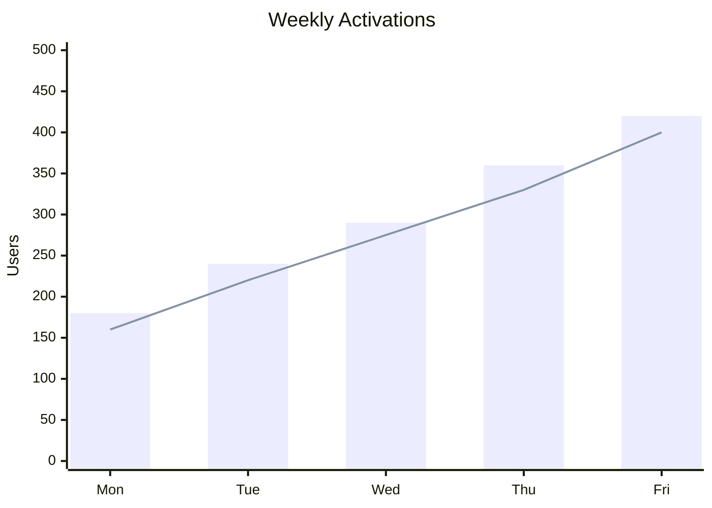

# Craft-Compatible Mermaid Syntax

Use this reference for the six diagram families intentionally supported by the
portable Craft-compatible renderer. Prefer simple syntax that survives parser
and host differences.

## Contents

1. Flowcharts
2. State diagrams
3. Sequence diagrams
4. Class diagrams
5. Entity-relationship diagrams
6. XY charts
7. Authoring rules

## Flowcharts

Use `graph LR` for short processes and `graph TD` for deep hierarchies.

Common shapes:

| Syntax | Meaning |
|---|---|
| `A[Label]` | Process |
| `A(Label)` | Rounded process |
| `A{Question?}` | Decision |
| `A[(Database)]` | Data store |
| `A([Start])` | Start or end |

Common edges:

| Syntax | Meaning |
|---|---|
| `A --> B` | Directed relationship |
| `A -->|label| B` | Labeled relationship |
| `A -.-> B` | Dotted relationship |
| `A ==> B` | Emphasized relationship |

Use `subgraph Name` and `end` for meaningful system boundaries. Avoid nesting
more than two levels.

## State Diagrams

Use `stateDiagram-v2`. Prefer horizontal direction for small lifecycles.

Use `state "Readable label" as Identifier` when a state label contains spaces
or punctuation.

## Sequence Diagrams

Use sequence diagrams for APIs, authentication, asynchronous work, and ordered
interactions.

Useful blocks are `loop`, `alt`/`else`, `opt`, and `par`/`and`. Keep participant
count low enough that messages remain legible.

## Class Diagrams

Use class diagrams for domain models, interfaces, inheritance, and ownership.

Relationships:

| Syntax | Meaning |
|---|---|
| `<|--` | Inheritance |
| `<|..` | Realization |
| `*--` | Composition |
| `o--` | Aggregation |
| `-->` | Association |
| `..>` | Dependency |

Split large models by bounded context instead of drawing every class together.

## Entity-Relationship Diagrams

Use ER diagrams for persistent entities, keys, and cardinality.

Common cardinalities are `||` exactly one, `o|` zero or one, `|{` one or more,
and `o{` zero or more. Quote relationship labels containing punctuation.

## XY Charts

Use `xychart-beta` for small categorical comparisons and trends.

Ensure category and series lengths match. Use a table instead when exact values
matter more than visual comparison.

## Authoring Rules

- Keep node identifiers short and labels descriptive.
- Quote labels with `()`, `[]`, `{}`, colons, quotes, or path-like text.
- Avoid raw HTML and external image references.
- Avoid manual colors in Craft-compatible mode.
- Prefer fewer than 20 visible nodes per diagram; split by responsibility when
  density grows.
- Prefer fewer than 8 sequence participants.
- Use a second diagram for implementation detail instead of making one diagram
  simultaneously explain overview and internals.
- Validate by rendering before delivery.
